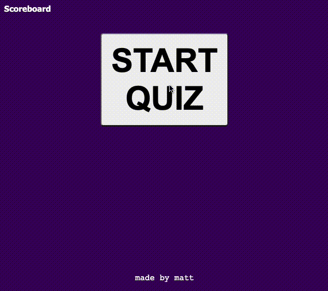

# A Javascript Quiz

[link to deployed quiz](http://matthewxgoad.github.io/wrong-answers-only)

## Description

This project asks the user five random questions about Javascript. Wrong answers deduct time from the countdown. Correct answers award the user points. There is a scorboard tracker at the end of the quiz that tracks the user's high scores by their initials. 

## Credits

This project is coded by Matthew Goad with help from instructors and tutors from the Washington University / Trilogy Education Coding Boot Camp program. 

I also used [this site](https://www.sitepoint.com/simple-javascript-quiz/) and [this video](https://www.youtube.com/watch?v=riDzcEQbX6k) to help understand coding a Javascript quiz. 

A thousand thank yous to my friend Kurt that helped me figure out the damn countdown timer for this assignment. 